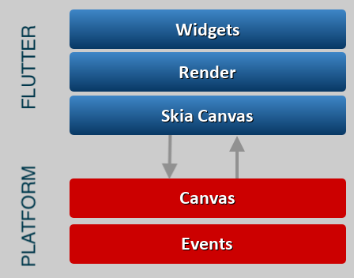
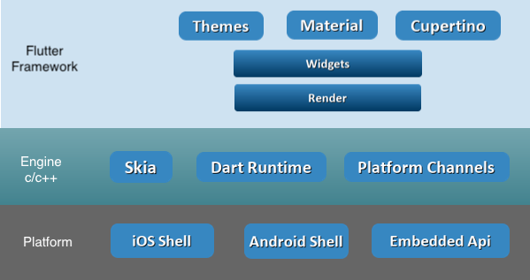

# Flutter

## Wat is Flutter?

* UI Toolkit
    * Cross-platform: mobile (Android/iOS), desktop, embedded
    * Gebruikt Dart als programmeertaal:
        * Laat toe om AOT (Ahead Of Time) te compileren wat performantie en opstarttijd ten goede komt.
        * Maar ook om JIT (Just In Time) te compileren, waardoor hot reload tijdens development mogelijk is.
        * Compileert naar native ARM en x86 code (=> native op iOS, Android) en JS (=> browser)

### Widgets

* In Flutter is alles dat je ziet een "Widget"
    * Text, Column, Row, Padding, ...
* Een Widget beschrijft
* Door Widgets te combineren en te nesten bouw je de volledige applicatie op. (Widget Tree)

Er zijn 2 type widgets:

* Stateless Widgets
    * Bewaren geen interne state en zijn volledig statisch.
    * Kunnen props van bovenaf krijgen, maar beheren geen interne "state"
    * Bvb een simpele "Text" Widget.
* Stateful Widgets
    *

### Renderen van Widgets

* Voor het tonen van de volledige Widget Tree schrijft Flutter rechtstreeks naar een Skia Canvas.
* Dit zorgt ervoor dat er geen "trage" WebView wordt gebruikt (bvb Ionic) of een bridge nodig is om JS en native met elkaar te doen verstaan (React Native).
* (Skia canvas is wat bvb. native Android en Google Chrome ook gebruiken om te renderen)

Flutter geeft ons de optie om de kiezen tussen:

* Material Design (Android) widgets.
* Cupertino (iOS) widgets.

